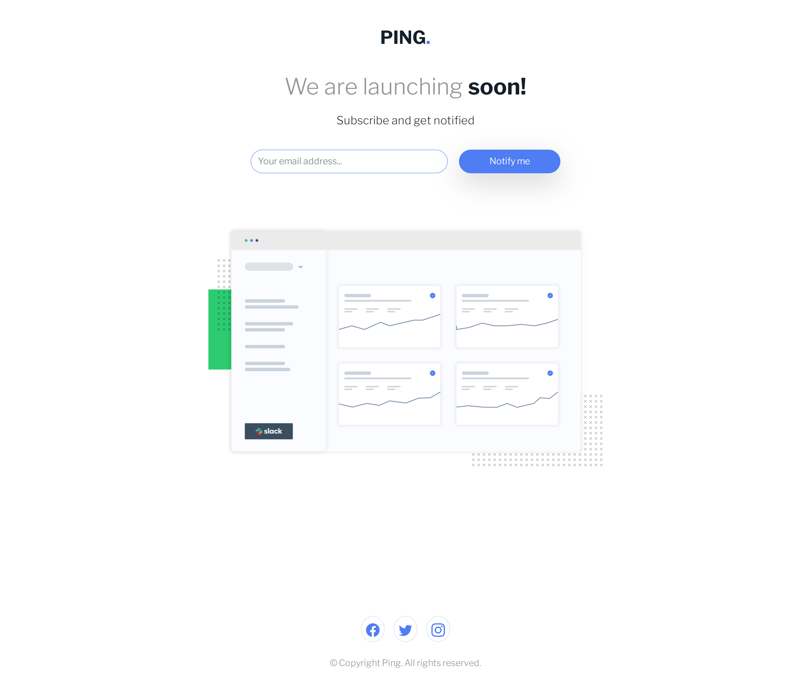

# 👩‍💻 Ping coming soon page

## The challenge

The challenge is to build out this coming soon page and get it looking as close to the design as possible.

Users should be able to:

- View the optimal layout for the site depending on their device's screen size
- See hover states for all interactive elements on the page
- Submit their email address using an `input` field
- Receive an error message when the `form` is submitted if:
	- The `input` field is empty. The message for this error should say *"Whoops! It looks like you forgot to add your email"*
	- The email address is not formatted correctly (i.e. a correct email address should have this structure: `name@host.tld`). The message for this error should say *"Please provide a valid email address"*

## Built with

- Semantic HTML5 markup
- Bootstrap
- Mobile-first workflow
- JavaScript

  <h3>
    <a href= "https://amansgz.github.io/bootstrap-ping-coming-soon-page/">
      Live site
    </a>
     | 
    <a href= "https://www.frontendmentor.io/challenges/ping-single-column-coming-soon-page-5cadd051fec04111f7b848da">
      Challenge
    </a>
  </h3>

This application/site was created as a submission to <a href= "https://www.frontendmentor.io/">Frontend Mentor Challenges</a> 
